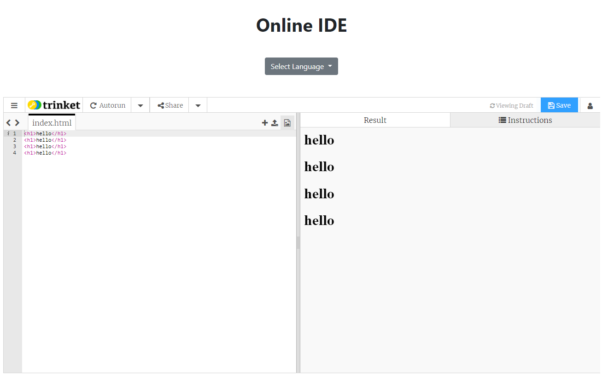

# Learn-Programming-Language
   & Bootstrap  

<i><b>The project that won the First Place in State Level Hackathon 2022</b></i> 

I worked on Frontend part of the project.

Built a website that allows you to choose the programming languages to learn.

Online IDE is been integrated to practice coding.
 

  

 
<h1>Home Page</h1>
 

  

 
<h1>Domains</h1>
 

  

 
<h1>Features</h1>
 

  

 
<h1>Languages</h1>
 

  

 
<h1>Online IDE</h1>
 

  

